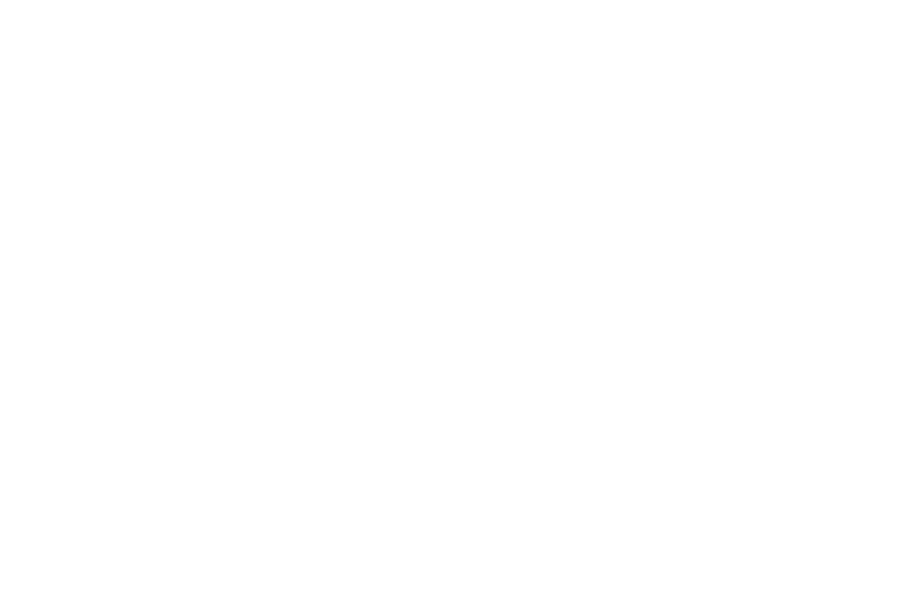

# Tic-Tac-Toe

<div align="center">
    
    <h1>Dic-Dac-Doe</h1>
</div>

<details open>
<summary>Table of Contents</summary>
<ol>
    <li>
    <a href="#introduction">Introduction</a>
    </li>
    <li>
    <a href="#features">Features</a>
    </li>
    <li><a href="#contributing">Contributing</a></li>
    <li><a href="#license">License</a></li>
</ol>
</details>

## Introduction
A simple and interactive Tic-Tac-Toe game built using HTML, CSS, and JavaScript. Play against a friend and enjoy the classic gam    e!
<p align="right"><a href="#readme-top">Back to top</a></p>

## Features
- 🎮 Two-Player Mode – Play with a friend on the same device
- 🏆 Win Detection – Automatically checks for a winner or a draw
- 🔄 Restart Option – Reset the game anytime with a button
<p align="right"><a href="#readme-top">Back to top</a></p>

## Built With 
[![HTML]][HTML-url]
[![CSS]][CSS-url]
[![Javascript]][Javascript-url]
<p align="right"><a href="#readme-top">Back to top</a></p>


## Future Improvements
- [ ] Add animations and background music
- [ ] Add responsive design for mobile users
<p align="right"><a href="#readme-top">Back to top</a></p>


## Contributing 
1. **Fork** the repository
2. Create a new **feature branch** 
    ```sh
    git checkout -b feature-name
    ```
3. **Commit** your changes
    ```sh
    git commit -m "Added new feature"
    ```
4. **Push** the branch
    ```sh
    git push origin feature-name
    ```
5. Create a **pull request**
<p align="right"><a href="#readme-top">Back to top</a></p>

## License
MIT License

Copyright (c) 2025 Devin

Permission is hereby granted, free of charge, to any person obtaining a copy
of this software and associated documentation files (the "Software"), to deal
in the Software without restriction, including without limitation the rights
to use, copy, modify, merge, publish, distribute, sublicense, and/or sell
copies of the Software, and to permit persons to whom the Software is
furnished to do so, subject to the following conditions:

The above copyright notice and this permission notice shall be included in all
copies or substantial portions of the Software.

THE SOFTWARE IS PROVIDED "AS IS", WITHOUT WARRANTY OF ANY KIND, EXPRESS OR
IMPLIED, INCLUDING BUT NOT LIMITED TO THE WARRANTIES OF MERCHANTABILITY,
FITNESS FOR A PARTICULAR PURPOSE AND NONINFRINGEMENT. IN NO EVENT SHALL THE
AUTHORS OR COPYRIGHT HOLDERS BE LIABLE FOR ANY CLAIM, DAMAGES OR OTHER
LIABILITY, WHETHER IN AN ACTION OF CONTRACT, TORT OR OTHERWISE, ARISING FROM,
OUT OF OR IN CONNECTION WITH THE SOFTWARE OR THE USE OR OTHER DEALINGS IN THE
SOFTWARE.
<p align="right"><a href="#readme-top">Back to top</a></p>


[HTML]: https://img.shields.io/badge/HTML-%23E34F26.svg?style=for-the-badge&logo=html5&logoColor=white
[HTML-url]: https://html.spec.whatwg.org/multipage/

[CSS]: https://img.shields.io/badge/CSS-1572B6?style=for-the-badge&logo=css3&logoColor=fff
[CSS-url]: https://www.w3.org/Style/CSS/Overview.en.html

[Javascript]: https://img.shields.io/badge/JavaScript-F7DF1E?style=for-the-badge&logo=javascript&logoColor=000
[Javascript-url]: https://262.ecma-international.org/14.0/